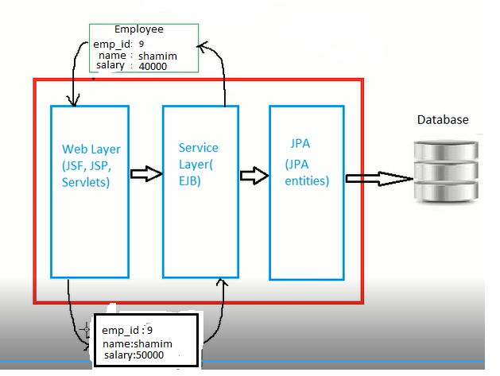

### Persistence by java ###
Following solution offer by java to persistence object into RDBMS

1. Jdbc
2. Entity Beans(J2EE)
3. JDO
4. JPA	

### JPA ###
The Java Persistence API (JPA) is a vendor independent specification(classes and interface) for mapping Java objects(POJO) to the tablesof relational databases(ORM = Object relational mapping)

JPA is an open source API, therefore various enterprise vendors such as Oracle, Redhat, Eclipse, etc. provide new products by adding the JPA persistence flavor in them. Some of these products(Persistence Provider) include:

Hibernate, Eclipselink(reference implementation of JPA), Toplink, Spring Data JPA, etc.

JPA specification current version 2.1 (JSR No 338)
 
### Warmup ###

1. create maven java project by following command

	`mvn archetype:generate -DgroupId=com.javaaround -DartifactId=Jpa -DarchetypeArtifactId=maven-archetype-quickstart -DinteractiveMode=false`

2. Update AppTest.java
	```java
	package com.javaaround;

	import org.junit.Test;;

	
	/**
	 * Unit test for simple App.
	 */
	public class AppTest {
	   @Test
	   public void AppTest( ){
	        App.main(null);
	   }
	}
	```

3. Update junit version at pom.xml

	```xml
	<version>4.8.1</version>
	```

4. Run app by following command

	`mvn clean package`

### Steps To create Jpa Desktop App ###
Add Jpa 2.1.1 , Hibernate 4.3.9.Final since Hibernate 4.3+ now implements JPA 2.1. also mysql Dependency at pom.xml
```xml
<dependency>
  <groupId>org.eclipse.persistence</groupId>
  <artifactId>javax.persistence</artifactId>
  <version>2.1.1</version>
</dependency>
<dependency>
  <groupId>org.hibernate</groupId>
  <artifactId>hibernate-entitymanager</artifactId>
  <version>4.3.9.Final</version>
</dependency>
<dependency>
    <groupId>mysql</groupId>
    <artifactId>mysql-connector-java</artifactId>
    <version>5.1.6</version>
</dependency>
```
1. Create Entity class(Employee.java)

	```java
	package com.javaaround.model;
	import javax.persistence.Entity;  
	import javax.persistence.Id;  


	@Entity 
	public class Employee { 
		@Id   
		private int id;  
		private String firstName
		private Double salary;  
		  
		public int getId() {  
		    return id;  
		}  
		public void setId(int id) {  
		    this.id = id;  
		}  
		public String getFirstName() {  
		    return firstName;  
		}  
		public void setFirstName(String firstName) {  
		    this.firstName = firstName;  
		}  
		public Double getSalary() {  
		    return salary;  
		}  
		public void setSalary(Double salary) {  
		    this.salary = salary;  
		}  
	}	
	```	
2. Confiqure App(create main/resources/META-INF/persistence.xml file)
	```java
	<?xml version="1.0" encoding="UTF-8" ?>
	<persistence xmlns="http://xmlns.jcp.org/xml/ns/persistence"
	 xmlns:xsi="http://www.w3.org/2001/XMLSchema-instance" version="2.1"
	 xsi:schemaLocation="
	 http://xmlns.jcp.org/xml/ns/persistence 
	 http://xmlns.jcp.org/xml/ns/persistence/persistence_2_1.xsd"> 
	  <persistence-unit name="hibernatePU" transaction-type="RESOURCE_LOCAL">
	   	  
	      <provider>org.hibernate.ejb.HibernatePersistence</provider>
	      	
	      <class>com.javaaround.model.Employee</class>
	      <properties>
	          <property name="javax.persistence.jdbc.url" value="jdbc:mysql://localhost:3306/test" />
	          <property name="javax.persistence.jdbc.driver" value="com.mysql.jdbc.Driver" />
	          <property name="javax.persistence.jdbc.user" value="root" />
	          <property name="javax.persistence.jdbc.password" value="" />
	          <!-- flag for sql show or not at console -->
	          <property name="javax.persistence.jdbc.show_sql" value="true" /> 
	          <!-- create db table automatically -->
	          <property name="javax.persistence.schema-generation.database.action" value="create"/> 
	         
	    </properties>
	      
	   </persistence-unit>      	
	</persistence>

	```	

3. Use `EntityManager` (JPA Api) to perform crud(create,read,update,delete);

	Update App.java
	
	```java
	EntityManagerFactory emf = Persistence.createEntityManagerFactory( "hibernatePU" );
	EntityManager em = emf.createEntityManager();

	//start transaction
	em.getTransaction( ).begin( );

	Employee employee = new Employee( ); 
	employee.setId( 1201 );
	employee.setFirstName( "Gopal" );
	employee.setSalary( 40000 );

	em.persist( employee );
    
    //find by id
	Employee persistedEmployee = em.find(Employee.class,1201)
	System.out.print("Employee name = " + persistedEmployee.getFirstName());

	//update  
	//there is no update method to update.Update is done by make change of entity
	persistedEmployee.setSalary(20000);
    
    //delete 
     //em.remove(persistedEmployee);

	//end transaction
	em.getTransaction( ).commit( );

	//close resource
	em.close( );

	system.out.print(employee.getFirstName());
	emf.close( );

	```	

Run app by following command

`mvn clean package`	

### JPA Entity Life Cycle ###

 

There are five states: 

1. does not exist : 
2. New/Transient : when an entity created by new operator.it has no effect at database
.if you want to any field is not managed/saved,you can mark it @Transient.

	```java
	@Transient
	private byte[] picture;
	``` 

3. Managed/Persisted  : 	when an entity is assoicate with `EntityManager` by its method e.g persist,find.merge etc then that object is going to managed state. 
	1. em.persist(employee);
	2. @PrePersist
	3. Database insert
	4. PostPersist

	when managed object property changed,then automatically update with db also.

	1. @PreUpdate
	2. Database Update
	3. @PostUpdate	

	Persistence context is the collection of all managed entity of an EntityManager. you can check if a specified entity object is in the persistence context:

	` boolean isManaged = em.contains(employee);`

	The persistence context can be cleared by using the clear method, as so:

    `em.clear();`


	If an entity object that has already exists in the persistence context the existing managed entity object is returned without actually accessing the database by call `em.find(employee.class,1201)`.

	but em.refresh(employee)  executes then always

		1. fetch the object from database
		2. @PostLoad

4. Remove : when `em.remove(persistedEmployee);` then object goes to remove state

	1. @PreRemove
	2. Pending removal from database until transaction is commit. if transaction commit then finally remove from db.
	3. @PostRemove

5. Detached : when 	`em.detach(employee);` or `em.close` then object to detached state

	1.  the entity is serialized to another tier

	if you want to detached back to managed, the following occurs: the entity is de-serialized, `em.merge(employee)` is invoked		

Update Employee.java
```java
import javax.persistence.PrePersist;
import javax.persistence.PostPersist;
import javax.persistence.PreUpdate;
import javax.persistence.PostUpdate;

@PrePersist
public void validate() {
   System.out.println("validating employee......");
}

@PostPersist
public void afterSave(){
	System.out.println("saved successfully.thank you");
}

@PreUpdate
public void validateUpdate() {
   System.out.println("validating  updating......");
}

@PostUpdate
public void afterUpdate(){
	System.out.println("Update successfully.thank you");
}
```

Run App

### Entity Listener ###
Mixing lifecycle event(cross-cutting event) code into your persistent classes is not recommended because it is not usable. JPA allows for use to separate another class and include it by `@EntityListeners` annotation.


create EmployeeListener.java

```java
package com.javaaround.listener;
import javax.persistence.PrePersist;
import javax.persistence.PostPersist;
import javax.persistence.PreUpdate;
import javax.persistence.PostUpdate;
import com.javaaround.model.Employee;
public class EmployeeListener {
	@PrePersist
    public void validate(Object obj) {
       System.out.println("validating employee......" + ((Employee) obj).getId ());
    }

	@PostPersist
	public void afterSave(Object obj){
		System.out.println("saved successfully.thank you");
	}

	@PreUpdate
	public void validateUpdate(Object obj) {
	   System.out.println("validating  updating......");
	}

	@PostUpdate
	public void afterUpdate(Object obj){
		System.out.println("Update successfully.thank you");
	}
}
```

Update Employee.java 

```java
@Entity
@EntityListeners({ 
	EmployeeListener.class
})
@Data 
public class Employee { 

```

### Default Entity Listener ### 

Default entity listeners are listeners that should be applied by default to all the entity classes.to skip it using the @ExcludeDefaultListeners annotation. Currently, default listeners can only be specified in a mapping XML file because there is no equivalent annotation.The mapping file has to be located either in the default location, META-INF/orm.xml or  in another location that is specified explicitly in the persistence unit definition

```xml
<persistence-unit name="hibernatePU" transaction-type="RESOURCE_LOCAL">
   <mapping-file>META-INF/myFile.xml</mapping-file>   
</persistence-unit> 
```

create DefaultListener.java

```java
package com.javaaround.listener;
import javax.persistence.PrePersist;
import javax.persistence.PostPersist;
import javax.persistence.PreUpdate;
import javax.persistence.PostUpdate;
import com.javaaround.model.Employee;
public class DefaultListener {
	@PrePersist
    public void validate(Object obj) {
       System.out.println("default validating ......");
    }

	@PostPersist
	public void afterSave(Object obj){
		System.out.println("default saved successfully.thank you");
	}

	@PreUpdate
	public void validateUpdate(Object obj) {
	   System.out.println(" default validating  updating......");
	}

	@PostUpdate
	public void afterUpdate(Object obj){
		System.out.println("default Update successfully.thank you");
	}
}
```

create orm.xml at META-INF

```xml
<entity-mappings xmlns="http://java.sun.com/xml/ns/persistence/orm"
 xmlns:xsi="http://www.w3.org/2001/XMLSchema-instance"
 xsi:schemaLocation="http://java.sun.com/xml/ns/persistence/orm
 http://java.sun.com/xml/ns/persistence/orm_1_0.xsd" version="1.0">
  <persistence-unit-metadata>
    <persistence-unit-defaults>
      <entity-listeners>
        <entity-listener class="com.javaaround.listener.DefaultListener" />
        <!-- <entity-listener class="samples.MyDefaultListener2" /> -->
      </entity-listeners>
    </persistence-unit-defaults>
  </persistence-unit-metadata>
</entity-mappings>
```

Run app again

### Superclass listener ###

By default Listeners that are attached to an entity class are inherited by its subclasses. to skip invoking any listeners declared in superclasses using the @ExcludeSuperclassListeners annotation

```java
import javax.persistence.ExcludeSuperclassListeners;
@Entity @ExcludeSuperclassListeners
public class Manager extends Employee {
}
```

### Callback Invocation Order ###

If more than one callback method has to be invoked for a lifecycle event (e.g. from multiple listeners) the invocation order is based on the following rules:

Default Listener -> top super class-> then super class-> actual enity listener


@NotNull: Checks whether the value is not null, disregarding the content
@NotEmpty: Checks whether the value is not null nor empty. If it has just empty spaces, it will allow it as not empty
@NotBlank: Checks whether the value is not null nor empty, trimming the value first. It means that, it won’t allow just empty spaces


### Parameters ###

JPA Parameter | Description | Hibernate Equivalent | Spring Data Equivalent
-------------- | ----------- | -------------------- | ----------------------
javax.persistence.jdbc.url | specify jdbc url | hibernate.connection.url | spring.datasource.url
javax.persistence.jdbc.driver |  specify jdbc driver | hibernate.connection.driver_class | spring.datasource.driver-class-name
javax.persistence.jdbc.user |  specify db user | hibernate.connection.username | spring.datasource.username
javax.persistence.jdbc.password |  specify db password | hibernate.connection.password | spring.datasource.password
javax.persistence.schema-generation.database.action : value allow `none,create,drop,drop-create` | automatically create schema(Table).  | hibernate.hbm2ddl.auto : value allow `create,update` | spring.jpa.generate-ddl=true &spring.jpa.hibernate.ddl-auto : value allow `create,update,none`
javax.persistence.jdbc.show_sql | flag for sql show or not at console | hibernate.show_sql | spring.jpa.show-sql
javax.persistence.sql-load-script-source | Defines the location of the SQL script that shall be used load data into the table at startup.| hibernate.hbm2ddl.import_files | spring.datasource.initialize<br>=true
javax.persistence.schema-generation.scripts.create-target | Defines the target location of the create script(DLL) generated by the persistence provider. | "" | ""
javax.persistence.schema-generation.scripts.drop-target | Defines the drop-target location of the create script(DLL) generated by the persistence provider. | "" | ""

Recommendation : Dont use provider specific thing.use jpa specific thing so that your code needs less code to change if you move another jpa provider(JPA provider independent)

### sql-load-script-source ###
create data.sql at main/resources

```sql
INSERT INTO employee (id, firstName,salary) VALUES (1, 'Md.Alamin',2000.00);
INSERT INTO employee (id, firstName,salary) VALUES (2, 'Md.Rafiq',2000.00);
```

update persistence.xml
```xml
<property name="javax.persistence.schema-generation.database.action" value="drop-and-create"/>
<property name="javax.persistence.sql-load-script-source" value="data.sql"/>
```
Run app by following command

`mvn clean package`	


### Generate create & drop schema ### 

update persistence.xml
```xml
<property name="javax.persistence.schema-generation.scripts.action" value="drop-and-create"/>
<property name="javax.persistence.schema-generation.scripts.create-target" value="create.sql"/>
<property name="javax.persistence.schema-generation.scripts.drop-target" value="drop.sql"/>
```

this will generate `create.sql & drop.sql` at project root.


### Generator ###
In the above example
`employee.setId( 1201 ); ` need to set id manually but we can get value from database system e.g auto increment column.For that purpose,we need to use generator. 

There are 4 generator types<br/>

1. IDENTITY : Provider relies on an auto-incremented database column to generate the primary key
	-	Update Employee.java
		```java
		@Id 
		@GeneratedValue(strategy = GenerationType.IDENTITY)  
		private int id; 
		```

		Update App.java
		```java
		//employee.setId( 1204 );
		```
2. SEQUENCE : Provider requests the primary key value from a database sequence
	-	 if there is no sequence defined, provider creates a sequence automatically e.g. in case of Oracle database, hibernate it creates a sequence named HIBERNATE_SEQUENCE.

		Update Employee.java
		```java
		@Id 
		@GeneratedValue(strategy = GenerationType.SEQUENCE)  
		private int id; 
		```
	- if you want to give your own sequence

	  	Suppose you have following sequence
	  	```sql
	  	create sequence emp_seq
		minvalue 1
		maxvalue 9999999999999999999999999999
		start with 1
		increment by 2;
	  	```

		```java
		@Id 
		@GeneratedValue(strategy = GenerationType.SEQUENCE, generator = "emp_generator")
		@SequenceGenerator(name="emp_generator", sequenceName = "emp_seq", initialValue=1, allocationSize=2)  
		private int id; 
		```
		`allocationSize :`
		increment value.default value 50

3. TABLE : Provider uses a database table to get next sequence.The TABLE strategy is very similar to the SEQUENCE strategy:
	-   Suppose you have following table

		 

		```java
		@Id 
		@GeneratedValue(strategy = GenerationType.TABLE, generator = "t_generator")
		@TableGenerator(name="t_generator",table="generator", pkColumnName = "gen_key", 
		<br/>pkColumnValue = "gen_valueemp_id",valueColumnName = "gen_value",
		<br/>
		initialValue = 1, allocationSize = 1 )
		private int id; 
		```
4. AUTO : Provider selects the above generation strategy based on the used dialect.It is recommended to use when your database is not fixed.it is default strategy
	-	Example

		```java
		@Id
		@GeneratedValue 
		//or @GeneratedValue(strategy = GenerationType.AUTO)
		private int id;
		```

### lombok ###

Lombok tools automatically generates appropriate getters, setters, toString(),hashCode(),equals()

Add depenency at pom.xml

```xml
<dependency>
  <groupId>org.projectlombok</groupId>
  <artifactId>lombok</artifactId>
  <version>1.16.12</version>
</dependency>
```	
Update Employee.java
```java
/*	public int getId() {  
	    return id;  
	}  
	public void setId(int id) {  
	    this.id = id;  
	}  
	public String getFirstName() {  
	    return firstName;  
	}  
	public void setFirstName(String firstName) {  
	    this.firstName = firstName;  
	}  
	public Double getSalary() {  
	    return salary;  
	}  
	public void setSalary(Double salary) {  
	    this.salary = salary;  
	}  */
```
You can test (employee.class) methods add or not by following command <br> 
`javap employee`

```java
public class com.javaaround.model.Employee {
  public com.javaaround.model.Employee();
  public int getId();
  public java.lang.String getFirstName();
  public java.lang.Double getSalary();
  public void setId(int);
  public void setFirstName(java.lang.String);
  public void setSalary(java.lang.Double);
  public boolean equals(java.lang.Object);
  protected boolean canEqual(java.lang.Object);
  public int hashCode();
  public java.lang.String toString();
}
```
### Column Definition ###

@Column is used define database table column definition like length,column name,nullable etc

### @Column Element ###

| Element        | Description           | Default value  |
| ------------- |:-------------:| -----:|
| name     | Defines name of column | propertyName |
| unique      |  define a unique constraint on the column.Value allow (true,false)     |   false |
| nullable      |  define column value allow null or not.Value allow (true,false)     |   false |
| insertable      |   Whether the column is included in SQL INSERT statements generated by the persistence provider .Value allow (true,false)     |   true |
| updatable      |  Whether the column is included in SQL UPDATE statements generated by the persistence provider .Value allow (true,false)     |   true |
| columnDefinition       |  define column data types.     |   basic mapping |
| length       |  define column size of string type     | highest value|
| precision       |  The precision is the number of digits in the unscaled value. For instance, for the number 123.45, the precision returned is 5.      | |
| Scale       |  Number of digits to the right of the decimal point. For instance, for the number 123.45, the scale returned is 2.      | |
| description       |  remarks of the column      | |
| table       |  specify secondary table to store it with this table      | |

Update Employee.java

```java
@Basic(fetch=FetchType.LAZY,optional=false)
@Column(name="first_name",length=35,nullable=true)  
private String firstName;
//salary less than 10000000(1crore)
@Column(precision=7, scale=2)
private Double salary; 
@Column(columnDefinition="TIMESTAMPTZ")
private Date joinDate;
@Column(description="M for Male,F for female")
private Gender gender;
```

### @Table Element ###

Bedefault class name is used to table name . you can give your custom name by @Table annotation
`@Table(name="employesssss")`

@Table annotation can also for used to define constraints of a field.`@Table(uniqueConstraints=@UniqueConstraint(columnNames="firstName"))`

### JPA Types ###

1. Entity Types : object has own identity(primary key value) e.g Employee
2. Value Types : Object has no database identity(no primary key) . Value Type object belongs to an Entity Type Object.
	1. Basic Types :  they map a single database value (column) to a single Java type. e.g String, Character, Boolean, Integer, Long, Byte
	2. Composite(Embeddable) Types : There are some custom object(Address) are associated of another entity object(Employee). it is not saved into db as separate table.
	3. Collection types :  collection of Basic value types, Composite types and custom types. it is saved into db as a separate table.
			
### Attribute Mappings ###

1. Basic Mappings : 

	Mappings of simple Java types(String, Number, Wrapper,Date ,primitive,enums, and any other type that implements java.io.Serializable) map directly to the column value in the database. The following table shows mapping java type to db types
	
	| Java Type        | Database Type | 
	| ------------- |:-------------:| 
	| String (char, char[]) |	VARCHAR (CHAR, VARCHAR2, CLOB, TEXT) | 
	| Number (BigDecimal, BigInteger, Integer, Double, Long, Float, Short, Byte) |	NUMERIC (NUMBER, INT, LONG, FLOAT, DOUBLE | 
	| int, long, float, double, short, byte |	NUMERIC (NUMBER, INT, LONG, FLOAT, DOUBLE) | 
	| byte[] |	VARBINARY (BINARY, BLOB) | 
	| boolean (Boolean) |	BOOLEAN (BIT, SMALLINT, INT, NUMBER) | 
	| java.util.Date |	TIMESTAMP (DATE, DATETIME) | 
	| java.sql.Date |	DATE (TIMESTAMP, DATETIME) | 
	| java.sql.Time |	TIME (TIMESTAMP, DATETIME) | 
	| java.sql.Timestamp |	TIMESTAMP (DATETIME, DATE) | 
	| java.util.Calendar |	TIMESTAMP (DATETIME, DATE) | 
	| java.lang.Enum |	NUMERIC (VARCHAR, CHAR) | 
	| java.io.Serializable |	VARBINARY (BINARY, BLOB) | 

	In JPA a basic attribute is mapped through the `@Basic` annotation.it is default annotation 

	### @Basic Element ###

	| Element        | Description           | Default value  |
	| ------------- |:-------------:| -----:|
	| fetch     | Defines whether the value of the field should be lazily loaded or eagerly fetched. | EAGER |
	| optional      | Defines whether the value of the field  may be null.     |   true |


	Update Employee.java

	```java
	@Basic(fetch=FetchType.LAZY,optional=false)  
	private String firstName;
	```

	update App.java
	```java
	 //employee.setFirstName( "Md.Shamim Miah" );
	``` 

	not-null property references a null or transient value : com.javaaround.model.Employee.firstName exception shown

	Update Employee.java

	```java
	@Basic(fetch=FetchType.LAZY,optional=false) 
	private String firstName;
	```


	### Date Mapping ###
	Java 1.0, Java only had a java.util.Date type, which was both a date, time and milliseconds. 
	In Java 1.1 this was expanded to support the common database types with java.sql.Date, java.sql.Time, and java.sql.Timestamp, then to support internationalization Java created the java.util.Calendar type 

	Update Employee.java

	```java
	private Date joinDate;
	```

	update App.java
	```java
	  employee.setJoinDate(new Date());
	``` 

	above example will map database datetime datatype(default). but some database don't support datetime,they support date or time only.if wish to map it to a DATE or TIME then `@Temporal` annotation is used 

	### @Temporal ###
	| Element        | Value allow           | Default value  |
	| ------------- |:-------------:| -----:|
	| TemporalType     | DATE,TIME,DATETIME | DATETIME |

	```java
	@Temporal(TemporalType.DATE) 
	private Date joinDate;
	```

	### Enum Mapping ###

	create Gender.java

	```java
	package com.javaaround.util;
	public enum Gender{
		F,M
	}	
	```

	Update Employee.java

	```java
	private Gender gender;
	```

	Update App.java

	```java
	employee.setGender(Gender.M);
	```

	By Default (ORDINAL) enum store  position of enum constant above example Gender.M is 1

	if you want to string (M or F) instead of position(1 or 2) value need to override  @Enumerated

	### @Enumerated ###
	| Element        | Value allow           | Default value  |
	| ------------- |:-------------:| -----:|
	| EnumType     | ORDINAL,STRING | ORDINAL |

	Update Employee.java

	```java
	@Enumerated(EnumType.STRING)
	private Gender gender;
	```

	### Large OBject ###
	There two database types of large object.
	1. BLOB (Binary LOB)
	2. CLOB (Character LOB). we know VARCHAR(255 character) have size limitations.for allow big text by using CLOB.

	JPA defines the @Lob annotation  to define an attribute maps to a LOB type in the database.A @Lob may be either a binary or character or serialize type.

	update Employee.java
	```java
	@Lob
	@Basic(fetch=FetchType.LAZY)	
	private byte[] picture;
	@Lob
	//private char[] remarks;	
	private String remarks;
	```

	To generate byte[] array we use apache commons io

	add dependency at pom.xml

	```xml
	<dependency>
        <groupId>commons-io</groupId>
        <artifactId>commons-io</artifactId>
        <version>2.5</version>
    </dependency>
	```

	Update App.java

	```java
	employee.setRemarks("luren ipsomluren ipsomluren ipsomluren " 
	  	+ "ipsomluren ipsomluren ipsomluren ipsomluren ipsomluren "
	  	+ "ipsomluren ipsomluren ipsomluren ipsomluren ipsomluren "
	  	+ "ipsomluren ipsomluren ipsomluren ipsomluren ipsomluren "
	  	+ "ipsomluren ipsomluren ipsomluren ipsomluren ipsomluren "
	  	+ "ipsomluren ipsomluren ipsomluren ipsomluren ipsomluren "
	  	+ "ipsomluren ipsomluren ipsomluren ipsomluren ipsomluren "
	  	);

	  //
	  FileInputStream fis;
	  try{
	  	fis = new FileInputStream("E:/shamim/image/shamim.jpg");
	  	byte[] bytes = IOUtils.toByteArray(fis);
	  	employee.setPicture(bytes);
	  }catch(Exception e){

	  }
	```

	### Converter ###

	The following example use java 8 date.or you can use jodatime date

	Update Employee.java

	```java
	import java.time.LocalDate;

	private Boolean isActive;
	private LocalDate createDate;
	```

	Update App.java

	```java
	 employee.setIsActive(Boolean.TRUE);
	 employee.setCreateDate(LocalDateTime.now().toLocalDate());
	```
	Run App

	Result : Boolean use @Basic mapping it converts 0,1
	LocalDate can't convert date type !!!

	if you want to Boolean convert to String eg. "T", "F"
	LocalDate need to convert Date object at java side 

	For that JPA 2.1 introduced Attribute Converter .  A Converter is a user defined class that provides custom conversion Logic in Java code and mark it @Converter annotation

	Create BooleanConverter.java

	```java
	package com.javaaround.converter;
	import javax.persistence.AttributeConverter;
	import javax.persistence.Converter;

	@Converter
	public class BooleanConverter implements AttributeConverter<Boolean, String> {

	 
	   @Override
	   public String convertToDatabaseColumn(Boolean isActive) {
	     return Boolean.TRUE.equals(isActive) ? "T" : "F";
	   }
	   
	   @Override
	   public Boolean convertToEntityAttribute(String value) {
	       return "T".equals(value);
	   }

	}
	```

	Create LocalDateConverter.java

	```java
	package com.javaaround.converter;
	import javax.persistence.AttributeConverter;
	import javax.persistence.Converter;
	import java.sql.Date;
	import java.time.LocalDate;

	@Converter
	public class LocalDateConverter implements AttributeConverter<LocalDate, Date> {

	 
	   @Override
	   public Date convertToDatabaseColumn(LocalDate localDate) {
	     return localDate == null ? null : Date.valueOf(localDate);
	   }
	   
	   @Override
	   public LocalDate convertToEntityAttribute(Date date) {
	       return date == null ? null : date.toLocalDate();
	   }

	}
	```

	There are two way to apply the above converter

	1. Using @Convert annotation
	2. global Converter(autoApply=true)

	We are using LocalDateConverter by global converter

	Update LocalDateConverter.java

	`@Converter(autoApply=true)`

	We are using BooleanConverter by @Convert annotation

	Update Employee.java

	```java
	import com.javaaround.converter.BooleanConverter;
	import javax.persistence.Convert;

	@Convert(converter=BooleanConverter.class)
	private Boolean isActive;
	
	```

2. User defined type Mapping :
	

	1. Embeddable Object : Eevery property of Embeddable(Address) are mapped to db column. Such object are marked by @Embeddable annotation.

		Add Address.java

		```java
		package com.javaaround.model;
		import javax.persistence.Embeddable;  
		import javax.persistence.Column;
		import lombok.Data;

		@Embeddable
		@Data 
		public class Address { 
			
			private String street;
			private String city;
			@Column(name="post_code")
			private String postcode;

		}	
		```

		Embedd this object to associated entity by @Embedded annotation

		Update Employee.java

		```java
		@Embedded
		private Address homeAddress;
		```

		if you have two Address object in same entity what happens ? 


		```java
		@Embedded
		private Address homeAddress;
		@Embedded
		private Address officeAddress;
		```
	    Run app 

		it shows Repeated column in mapping for entity.How we can solve it.We need to override default column name(street,city,post_code) by using @AtrributeOverride Annotation of homeAddreess or officeAddress(any one . other take default).

		Update Employee.java

		```java
		Embedded
		//street = field name
		@AttributeOverrides({
			@AttributeOverride(name="street",column=@Column(name="home_street")),
			@AttributeOverride(name="city",column=@Column(name="home_city")),
			@AttributeOverride(name="postcode",column=@Column(name="home_post_code"))
		})
		private Address homeAddress;

		@Embedded
		private Address officeAddress;
		```

		Some time we need composite primary key to identify records. For example employee are identity by id and department name. There are two way to assign composite primary key

		1. Using @IdClass
		2. Using @EmbeddedId 

		Create Embeddable class EmployeeId.java

		```java
		package com.javaaround.model;
		import java.io.Serializable;
		import javax.persistence.Embeddable;  
		import lombok.Data;

		@Embeddable
		@Data 
		public class EmployeeId implements Serializable{ 
			private int id;
			private String deptName;
			
		}	
		```

		Embedded above object to Employee and mark it by @EmbeddedId annotation

		Update Employee.java

		```java
		import javax.persistence.EmbeddedId;
		import javax.persistence.Entity; 
		@Entity
		@Data 
		public class Employee { 
			@EmbeddedId
			private EmployeeId employeeId;
			@Basic(optional=false)  
			private String firstName;
		```

		Update App.java

		```java
		  Employee employee = new Employee( );
	      employee.setFirstName( "Md.Shamim Miah" );

	      EmployeeId  empId = new EmployeeId();
	      empId.setId(222);
	      empId.setDeptName("IT");
	      employee.setEmployeeId(empId);
          //save into db	      
	      em.persist( employee );
		```

		Run App

		Above example using  @IdClass

		Update EmployeeId.java hide //@Embeddable

		```java
		//@Embeddable
		
		```
		Update Employee.java

		```java
		@Entity
		@IdClass(EmployeeId.class)
		@Data 
		public class Employee { 
			@Id
			private int id;
			@Id
			private String deptName;
			@Basic(optional=false)  
			private String firstName;
		}
		```

		update App.java

		```java
		Employee employee = new Employee( );
        employee.setFirstName( "Md.Shamim Miah" );
        employee.setId(222);
        employee.setDeptName("IT");
        em.persist(employee);
		```
	

	2. Inheritance Mapping

		 

		There are four strategy of inheritance mapping. Strategy are define by @InheritanceType
		```java
		public enum InheritanceType {
		    SINGLE_TABLE,
		    JOINED,
		    TABLE_PER_CLASS
		}; 

		```

		1. Mapped SupperClass

			In Mapped Supperclass strategy,keep basic properties in a super class and mark it @MappedSuperclass. It will not be associated with any database table.If we want to change the column name different from super class, we need to use @AttributeOverride

			Update Employee.java

			```java
			import javax.persistence.MappedSuperclass;
			@MappedSuperclass
			@Data 
			public class Employee { 
				@Id 
				@GeneratedValue(strategy = GenerationType.AUTO)  
				private int id;
				@Basic(optional=false)  
				private String firstName;
			}
			```

			Create RegularEmployee.java

			```java
			package com.javaaround.model;
			import javax.persistence.Entity; 
			import javax.persistence.Column; 
			import javax.persistence.AttributeOverride; 
			import lombok.Data; 
			  
			@Entity
			@AttributeOverride( name="firstName", column = @Column(name="first_name") )
			@Data 
			public class RegularEmployee extends Employee{  
			    private Double salary;  
			    private int bonus;  
			   
			}  
			```

			Create ContactEmployee.java

			```java
			package com.javaaround.model;
			import javax.persistence.Entity; 
			import javax.persistence.Column; 
			import javax.persistence.AttributeOverride; 
			import lombok.Data; 
			  
			@Entity
			@AttributeOverride( name="firstName", column = @Column(name="first_name") )
			@Data 
			public class ContactEmployee extends Employee{  
			    @Column(name="pay_per_hour")  
			    private float pay_per_hour;  
			      
			    @Column(name="contract_duration")  
			    private String contract_duration;  
			   
			}  
			```

			Update App.java

			```java
			ContactEmployee employee = new ContactEmployee( ); 
	        employee.setFirstName("Md.Shamim");
	        employee.setPay_per_hour(122);
	        employee.setContract_duration("2 years");
	        RegularEmployee employee1 = new RegularEmployee( ); 
	        employee1.setFirstName("Md.Shamim1");
	        employee1.setSalary(122.00);
	        employee1.setBonus(1000);

            //save into db	      
	        em.persist( employee );
	        em.persist( employee1 );
			```

			

			There are following problem of above strategy
			1.  Cannot query, persist, or have relationships because it has no entity

		2. SINGLE_TABLE	 strategy

			The single table strategy maps all entities of the inheritance structure to the same database table. It is default strategy . Here, an extra column (also known as discriminator column) is created in the table to identify the  subclass.


			Update Employee.java

			```java
			@Entity 
			//@MappedSuperclass
			```

			Run App

			Result : 

			

			In the above image, By default

			1. discriminator column = DTYPE . you can overrid by @DiscriminatorColumn

				### @DiscriminatorColumn ###
				| property        | Description 
				| ------------- |:-------------:
				| name     | Column name of discriminator
				| discriminatorType     | DiscriminatorType enum.value CHAR,INTEGER,STRING,CLASS.default String
				| 	columnDefinition     | Define column data type. The default is generated by the Persistence provider and is implementation-specific
				| 	length     | The column length for String-based discriminator types

			2. discriminator Value = class name . you can overrid by @DiscriminatorValue
			
			Update Employee.java

			```java
			import javax.persistence.DiscriminatorColumn;
			import javax.persistence.DiscriminatorType;
			@DiscriminatorColumn(name="type",discriminatorType=DiscriminatorType.STRING)  
			```	

			Update ContactEmployee.java

			```java
			import javax.persistence.DiscriminatorValue; 
			@DiscriminatorValue("outsideemp")  
			```

			Update RegularEmployee.java

			```java
			import javax.persistence.DiscriminatorValue; 
			@DiscriminatorValue("outsideemp")  
			```

			### Advantages ###

			Single table inheritance mapping is the fastest of all inheritance models, since it never requires a join to retrieve a persistent instance from the database. Similarly, persisting or updating a persistent instance requires only a single INSERT or UPDATE statement. Finally, relations to any class within a single table inheritance hierarchy are just as efficient as relations to a base class.

			### Disadvantages ###

			The larger the inheritance model gets, the "wider" the mapped table gets, in that for every field in the entire inheritance hierarchy, a column must exist in the mapped table. This may have undesirable consequence on the database size, since a wide or deep inheritance hierarchy will result in tables with many mostly-empty columns 

		3. TABLE_PER_CLASS	Strategy

			In this strategy,each concrete class + supper class is mapped to a separate table in the database . To define this strategy need to use `@Inheritance(strategy = InheritanceType.TABLE_PER_CLASS` annotation at parent table

			Update Employee.java

			```java
			@Inheritance(strategy = InheritanceType.TABLE_PER_CLASS)
			```

			Disadvantage of this approach is that duplicate columns are created in the subclass tables.This strategy provides poor support for polymorphic relationships and usually requires either SQL UNION queries or separate SQL queries for each subclass for queries that cover the entire entity class hierarchy.

		4. JOINED Strategy	

		   JOINED Strategy is very similar TABLE_PER_CLASS but now supper class property can't store sub class .  they are reated using primary and foreign key. So there will not be duplicate columns in the relation.

		   Some JPA providers support joined inheritance with or without a discriminator column, some required the discriminator column, and some do not support the discriminator column. So joined inheritance does not seem to be fully standardized yet.

		   Hibernate: A discriminator column on joined inheritance is supported but not require

		   Update Employee.java

		   ```java
		   @Inheritance(strategy = InheritanceType.JOINED)
		   ````

		   Subclass map by @PrimaryKeyJoinColumn annotation  to define foreign key
		   ### @PrimaryKeyJoinColumn ###
			| property        | Description 
			| ------------- |:-------------:
			| name     | Column name of foreign key
			| referencedColumnName      | The name of the primary key column of the table being joined to.
			| 	columnDefinition     | Define column data type. 
			
			Update ContactEmployee.java

			```java
			import javax.persistence.PrimaryKeyJoinColumn; 
		    @PrimaryKeyJoinColumn(name="employee_id", referencedColumnName="id")
		    ````

		    Update RegularEmployee.java
			
			```java
			import javax.persistence.PrimaryKeyJoinColumn; 
		    @PrimaryKeyJoinColumn(name="employee_id", referencedColumnName="id")
		    ````

		    Disadvange  : 

		    the joined strategy is often the slowest of the inheritance models


3. Collection Mapping

	| Collection Form        | Description 
	| ------------- |:-------------:
	| indexed     | List and Map are index based collection, so an extra column will be created in the table for store index / key.
	| 	non-indexed     | Set is non-indexed.

	@ElementCollection annotation is used to collection(Collection or Map of Basic or Embeddable objects) mapping and stored in a separate table.

	### Basic Type Collection ###

	1. List

		Update Employee.java
		```java
		@ElementCollection
		@Column(name="CONTACT_LIST")
		private List<String> contacts;
		```

		Update App.java

		```java
		List<String> contacts = new ArrayList<String>();
        contacts.add("20111112550");
        contacts.add("20111555550");
        Employee employee = new Employee( ); 
        employee.setFirstName("Md.Shamim");
        employee.setContacts(contacts);
      
		```

		Run App

		Default Table created = Entity property name here contacts.
        Dafault foreign key = id

        you can override by `@JoinTable` or `@CollectionTable` annotation

        Update Employee.java

        ```java
        @JoinTable(name="Emp_contacts", joinColumns=@JoinColumn(name="employee_id"))
        ```

        Run App again

    2. Map
    
    	Update Employee.java

    	```java
    	@ElementCollection
		@Column(name="CONTACT_LIST")
		private Map<String, String> contacts;
    	```  

    	Update App.java

		```java
		Map contactMap = new HashMap(); 
	    contactMap.put("home","000-289-3214"); 
	    contactMap.put("mobile","001-760-2332"); 
        Employee employee = new Employee( ); 
        employee.setFirstName("Md.Shamim");
        employee.setContacts(contacts);
      
		```

		Run App 

		Default Table created = employeeentityname_property name e.g EMPLOYEE_ADDRESS . 
		Dafault foreign key = employeeentityname_employeeentityid field e.g EMPLOYEE_ID
		Extra column is create to store key value = property name_KEY e.g CONTACTS_KEY.It can overrid by `@MapKeyColumn` annotation `name` property

		Update Employee.java

		```java
		@ElementCollection
		@JoinTable(name="Emp_contacts", joinColumns=@JoinColumn(name="empl_id"))
		@MapKeyColumn(name="CONTACT_TYPE")
		@Column(name="CONTACT_LIST")
		private Map<String, String> contacts;
		```


		Run App  Again

		When key is enum type

		```java
		package com.javaaround.util;
		public enum PhoneType{
			HOME,OFFICE
		}
		```

		```java
		@ElementCollection
	    @CollectionTable(name="EMP_PHONE")
	    @MapKeyEnumerated(EnumType.STRING) // default orinal
	    @MapKeyColumn(name="PHONE_TYPE")
	    @Column(name="PHONE_NUM")
	    private Map<PhoneType, String> phoneNumbers = new HashMap();
		```

		when key is date type

		```java
		@MapKeyTemporal(TemporalType.DATE)
        protected java.util.Map<java.util.Date, Employee> employees;
		```


	### Embeddable Object Collection ###
	1. Set/List
	
		In the above we have two object(homeAddress,officeAddress) but if you have collection address(if you don't know how many address are needed) then lots of column created .it is not recommended. Instead we can create separate table and reference to employee id foreign key

		Update Employee.java

		```java
		import javax.persistence.ElementCollection;

		@ElementCollection
		private Set<Address> address = new HashSet();
		```
        For non generic Collection

        ```java
		import javax.persistence.ElementCollection;

		@ElementCollection(targetClass=Address.class)
		private Set address = new HashSet();
		```

		Update App.java

		```java
		 Address adr1 = new Address();
	     adr1.setStreet("parijat");
	     adr1.setCity("gazipure");
	     adr1.setPostcode("1200");

	     Address adr2 = new Address();
	     adr2.setStreet("bishasbettka");
	     adr2.setCity("tangail");
	     adr2.setPostcode("1900");

	     employee.getAddress().add(adr1);
	  	 employee.getAddress().add(adr2);
	     //save into db	      
	     em.persist( employee );
		```

		Run App

		 

		Default Table created = employeeentityname_property_name e.g EMPLOYEE_ADDRESS . 
		Dafault foreign key = employeeentityname_employeeentityid field e.g EMPLOYEE_ID
		you can override by `@JoinTable` or `@CollectionTable` annotation `joinColumns` property

		Update Employee.java

		```java
		import javax.persistence.JoinColumn;
		import javax.persistence.JoinTable;
		@JoinTable(
			name="emp_address",
			joinColumns = @JoinColumn(name="emp_id")
		)
		private Set<Address> address = new HashSet();
		```

		Address table has no primary key (Id) column. if you want to provide it through @CollectionId annotation.It is not standarise of jpa.it is hibernate specific feature.

		Remember :  Set do not support @CollectionId

		Update Employee.java

		```java
		@GenericGenerator(name = "hilo-gen",strategy = "hilo")
		@CollectionId(
			columns = { @Column(name="address_id")},
			generator = "hilo-gen",
			type = @Type(type="long")
		)
		private List<Address> address = new ArrayList<Address>();
		```
		Address table has generate now primary key (address_id) column.
	2. Map

		Key is basic and value is embeddable object

		Update Employee.java

		```java
		private Map<String,Address> contacts;
		```
		Update App.java
		```java
		Address homeAddress = new Address();
        homeAddress.setStreet("parijat");
        homeAddress.setCity("gazipure");
        homeAddress.setPostcode("1200");

        Address officeAddress = new Address();
        officeAddress.setStreet("bishasbettka");
        officeAddress.setCity("tangail");
        officeAddress.setPostcode("1900"); 

        Map<String,Address> contacts = new HashMap<String,Address>();
        contacts.put("home",homeAddress);
        contacts.put("office",officeAddress);
        Employee employee = new Employee( ); 
        employee.setFirstName("Md.Shamim");
        employee.setContacts(contacts);

		```

		Override Address column

		@AttributeOverride(name="street",column=@Column(name="street_name"))


		Key is entity and value is basic object

		Update Department.java

		```java
		@ElementCollection
	    @CollectionTable(name="EMP_SENIORITY")
	    @MapKeyJoinColumn(name="EMP_ID") // define key map column since it is join
	    @Column(name="SENIORITY")
	    private Map<Employee, Integer> seniorities;
		```

		Update App.java

		```java
		 Employee employee = new Employee( ); 
	      employee.setFirstName("Md.Shamim");
	      Employee employee1 = new Employee( ); 
	      employee1.setFirstName("Md.Shamim");
	      Map<Employee,Integer> seniorities = new HashMap<Employee,Integer>();
	      seniorities.put(employee,1);
	      seniorities.put(employee1,2);
	      
	      Department department = new Department();
	      department.setName("IT");
	      department.setSeniorities(seniorities);
	     
          //save into db	      
	      em.persist( department );
	      em.persist( employee );
	      em.persist( employee1 );	
		```

	### Entity Object Collection ###

	Entity Object Collection means relationship mapping at database

	1. OneToMany   -> ManyToOne : 


		

		Update Employee.java

		```java
		import javax.persistence.ManyToOne;
		@Entity 
		@Data 
		public class Employee { 
			@Id 
			@GeneratedValue(strategy = GenerationType.AUTO)  
			private int id;
			@Basic(optional=false)  
			private String firstName;
			@ManyToOne
			private Department department;
			
		}	
		```

		Update Department.java

		```java
		@Entity
		@Data 
		public class Department { 
			@Id 
			@GeneratedValue
			private int id;
			@Basic(optional=false)  
			private String name;
			
		}		
		```

		Run App

		error :  object references an unsaved transient instance - save the transient instance before flushing

		Solution :
		1. Save manually department instance
		`em.persist(department);`
		2. Save automatically using cascade (recommended)

		Run App
		 default create join column format owingenityname_primary key. we can ovveride by @JoinColumn annotaion

		```java
		@ManyToOne
		@JoinColumn(name = "department_iddd")
		private Department department;

		```` 
			 

		JPA allows us to propagate entity state changes from Parents to Child entities automatically by `CascadeType` mappings. 
		### CascadeType Element ###

		| CascadeType        | Description
		| ------------- |:-------------:| 
		| ALL     | Cascade all operations | 
		| PERSIST     | Cascade PERSIST operations | 
		| MERGE     | Cascade MERGE operations | 
		| REMOVE     | Cascade REMOVE operations | 
		| REFRESH     | Cascade REFRESH operations | 
		| DETACH     | Cascade DETACH operations | 

		`@ManyToOne(cascade=CascadeType.ALL)`

		### Orphan Removal (JPA 2.0) ### 

		Cascading of the remove operation if and only occurs when the remove is called on the object(em.remove(employee)). This is not normally what is desired on a dependent relationship.When dependent entity(Department) setting null or refer to  another department then previous entity should be automatically without remove operation occur

		It is done by setting `orphanRemoval=true` on @OneToOne and @OneToMany annotations:


		In th above example is an unidirectional relationship since only one entity has a relationship field that refers to the other among two

		In a bidirectional relationship, both entity have a reference to each other 


		Update Department.java

		```java
		//Generic
		@OneToMany(mappedBy = "department")
		private List<Employee> employees;

		/* for non generic
		@OneToMany(mappedBy = "department",targetEntity=Phone.class)
		private List<Employee> employees;
		*/
		```

		Specifies the ordering of the elements of a collection by @OrderBy annotation 

		Order by primary key

		```java
		//Generic
		@OneToMany(mappedBy = "department")
		@OrderBy
		private List<Employee> employees;

		```

		Order by a string field.default asc

		```java
		//Generic
		@OneToMany(mappedBy = "department")
		@OrderBy("firstName")
		private List<Employee> employees;

		```

		Order by a string field by desc

		```java
		//Generic
		@OneToMany(mappedBy = "department")
		@OrderBy("firstName desc")
		private List<Employee> employees;

		```

		if embeddable use .(dot) notation

		```java
		@Entity 
	    public class Person {
	         ...
	       @ElementCollection
	       @OrderBy("zipcode.zip, zipcode.plusFour")
	       public Set<Address> getResidences() {...};
	       ...
	    }
	 
	    @Embeddable 
	    public class Address {
	       protected String street;
	       protected String city;
	       protected String state;
	       @Embedded protected Zipcode zipcode;
	    }
	 
	    @Embeddable 
	    public class Zipcode {
	       protected String zip;
	       protected String plusFour;
	    }
		```

		@OrderColumn is used to maintain the persistent order of a list

		```java
		@OneToMany(mappedBy = "department")
		@OrderColumn
		private List<Employee> employees;
		```

		Default column name `index` is created . we can override it + some behaviour


		```
		@OrderColumn(name="insert_order",columnDefinition="int",insertable=false,nullable=true,updatable=false)
		```

		You can fetch lazy loading

		```
		@OneToMany(mappedBy = "department",fetch=FetchType.LAZY)
		private List<Employee> employees;
		```

		Relationship attribute overrid by ` @AssociationOverride`

		```java
		@MappedSuperclass
	    public class Employee {
	        ...
	        @ManyToOne
	        protected Address address;
	        ...
	    }
	 
	    @Entity 
	        @AssociationOverride(name="address", 
	                             joinColumns=@JoinColumn(name="ADDR_ID"))
	        // address field mapping overridden to ADDR_ID foreign key
	    public class PartTimeEmployee extends Employee {
	        ...
	    }
	    ```

		Update Department

		```java
		@OneToMany(mappedBy = "department")
	    private Map<Integer, Employee> empMap;
		```

		Run App : extra column `EMPMAP_KEY` is generated . If the Map key is the primary key or a persistent field or property of the entity that is the Map value, use the @MapKey annotation then `EMPMAP_KEY` is not generated

		Update Department

		```java
		@OneToMany(mappedBy = "department")
		@MapKey
	    private Map<Integer, Employee> empMap;
		```

		if you want tp name of the persistent field or property of the associated entity that is used as the map key instead of primary field

		`@MapKey(name="empddd_id")`

		For non generic map @MapKeyClass is used define key type
		```java
	    @MapKeyClass(String.class)
        Map images; 
		```

		Note : @MapKeyClass && @MapKey is not use same time at a field


	2. ManyToMany

		

		In database,many to many relationships does not support. To suppor manyTomany,we require extra table that have two oneTomany relationship

		In JPA , ManyToMany relationship is defined through the @ManyToMany annotation

		Update Employee.java

		```java
		@ManyToMany(cascade=CascadeType.ALL)
        private List<Project> projects;
		```
		Create project.java

		```java
		package com.javaaround.model;
		import javax.persistence.Entity;  
		import javax.persistence.Id;
		import javax.persistence.GeneratedValue;
		import javax.persistence.ManyToMany;
		import lombok.Data;
		import java.util.List;

		@Entity
		@Data 
		public class Project { 
			@Id 
			@GeneratedValue
			private int id;
			private String name;
			@ManyToMany
		    private List<Employee> employees;
		}	
		```

		Since any entity does not foreign key(foreign key hava another table) you can pickup
		any one entity to define it through `@JoinTable` annotation.We pickup employee(owner) so project(inverse)

		Update Employee.java

		```java
		@JoinTable(
			name="EMP_PRO"
			joinColumns=@JoinColumn(name="EMP_ID", referencedColumnName="ID"),
			inverseJoinColumns=@JoinColumn(name="PROJ_ID", referencedColumnName="ID"))
		)
		```

		Update Project.java

		```java
		@ManyToMany(mappedBy="projects",cascade=CascadeType.ALL)
		```

		Update App.java

		```java
		Employee shamim = new Employee( ); 
        shamim.setFirstName("Md.Shamim");

        Project consProject = new Project();
        consProject.setName("Construction");

        Project trainingProject = new Project();
        trainingProject.setName("Training");

        //shamim have engaged many project
        List<Project> projects = new ArrayList<Project>();
        projects.add(consProject);
        projects.add(trainingProject);

        rafiq.setProjects(projects);
        //save into db	      
	    em.persist(shamim);
	    em.persist(rafiq);
		```

		Run App : 

		
		

		Default join table is create one enity_other entity here EMPLOYEE_PROJECT

		You can  specify own join table name

		```java
		@JoinTable(
			name="EMP_PRO"
			joinColumns=@JoinColumn(name="EMP_ID", referencedColumnName="ID"),
			inverseJoinColumns=@JoinColumn(name="PROJ_ID", referencedColumnName="ID"))
		)
		```

		Complex override

		```java
		@Entity
	    public class Employee {
	        @Id int id;
	        @AssociationOverride(
	          name="phoneNumbers",
	          joinTable=@JoinTable(
	             name="EMPPHONES",
	             joinColumns=@JoinColumn(name="EMP"),
	             inverseJoinColumns=@JoinColumn(name="PHONE")
	          )
	        )
	        @Embedded ContactInfo contactInfo;
	       ...
	    }
	 
	    @Embeddable
	    public class ContactInfo {
	        @ManyToOne Address address; // Unidirectional
	        @ManyToMany(targetEntity=PhoneNumber.class) List phoneNumbers;
	    }
	 
	    @Entity
	    public class PhoneNumber {
	        @Id int number;
	        @ManyToMany(mappedBy="contactInfo.phoneNumbers")
	        Collection<Employee> employees;
	     }
		```

		@MapsId designates a ManyToOne or  OneToOne relationship attribute that provides the mapping for an EmbeddedId primary key, an attribute within an EmbeddedId primary key, or a simple primary key of the parent entity(default).

		```java
		 // parent entity has simple primary key

	    @Entity
	    public class Employee {
	       @Id long empId;
	       String name;
	       ...
	    } 

	    // dependent entity uses EmbeddedId for composite key

	    @Embeddable
	    public class DependentId {
	       String name;
	       long empid;   // corresponds to primary key type of Employee
	    }

	    @Entity
	    public class Dependent {
	       @EmbeddedId DependentId id;
	       //@MapsId // maps the empid attribute of parent
	       @MapsId("empid")  //  maps the empid attribute of embedded id
	       @ManyToOne Employee emp;
	    }
		```

		### Mapping a Join Table with Additional Columns ###

		```java
		@Entity
		public class Employee {
		  @Id
		  private long id;
		  ...
		  @OneToMany(mappedBy="employee")
		  private List<ProjectAssociation> projects;
		  ...
		}
		@Entity
		public class Project {
		  @Id
		  private long id;
		  ...
		  @OneToMany(mappedBy="project")
		  private List<ProjectAssociation> employees;
		  ...
		  // Add an employee to the project.
		  // Create an association object for the relationship and set its data.
		  public void addEmployee(Employee employee, boolean teamLead) {
		    ProjectAssociation association = new ProjectAssociation();
		    association.setEmployee(employee);
		    association.setProject(this);
		    association.setEmployeeId(employee.getId());
		    association.setProjectId(this.getId());
		    association.setIsTeamLead(teamLead);

		    this.employees.add(association);
		    // Also add the association object to the employee.
		    employee.getProjects().add(association);
		  }
		}
		@Entity
		@Table(name="PROJ_EMP")
		@IdClass(ProjectAssociationId.class)
		public class ProjectAssociation {
		  @Id
		  private long employeeId;
		  @Id
		  private long projectId;
		  @Column(name="IS_PROJECT_LEAD")
		  private boolean isProjectLead;
		  @ManyToOne
		  @PrimaryKeyJoinColumn(name="EMPLOYEEID", referencedColumnName="ID")
		  /* if this JPA model doesn't create a table for the "PROJ_EMP" entity,
		  *  please comment out the @PrimaryKeyJoinColumn, and use the ff:
		  *  @JoinColumn(name = "employeeId", updatable = false, insertable = false)
		  * or @JoinColumn(name = "employeeId", updatable = false, insertable = false, referencedColumnName = "id")
		  */
		  private Employee employee;
		  @ManyToOne
		  @PrimaryKeyJoinColumn(name="PROJECTID", referencedColumnName="ID")
		  /* the same goes here:
		  *  if this JPA model doesn't create a table for the "PROJ_EMP" entity,
		  *  please comment out the @PrimaryKeyJoinColumn, and use the ff:
		  *  @JoinColumn(name = "projectId", updatable = false, insertable = false)
		  * or @JoinColumn(name = "projectId", updatable = false, insertable = false, referencedColumnName = "id")
		  */
		  private Project project;
		  ...
		}
		public class ProjectAssociationId implements Serializable {

		  private long employeeId;

		  private long projectId;
		  ...

		  public int hashCode() {
		    return (int)(employeeId + projectId);
		  }

		  public boolean equals(Object object) {
		    if (object instanceof ProjectAssociationId) {
		      ProjectAssociationId otherId = (ProjectAssociationId) object;
		      return (otherId.employeeId == this.employeeId) && 
		      (otherId.projectId == this.projectId);
		    }
		    return false;
		  }

		}
		```


### OneToOne Relation Mapping ###

Assume employee side contains foreign key


Update Employee.java

```java
@OneToOne(cascade=CascadeType.ALL)
@JoinColumn(name="empdetails_id")
private EmployeeDetails empDetails;
```

Create EmployeeDetails.java

```java
package com.javaaround.model;
import javax.persistence.Embeddable;  
import javax.persistence.Column;
import javax.persistence.Entity;
import javax.persistence.GeneratedValue;
import javax.persistence.GenerationType;
import javax.persistence.OneToOne;
import javax.persistence.CascadeType;
import javax.persistence.PrimaryKeyJoinColumn;
import javax.persistence.Id;
import javax.persistence.Column;
import lombok.Data;
import lombok.NoArgsConstructor;

@Entity
@Data
@NoArgsConstructor 
public class EmployeeDetails { 
	@Id 
	@GeneratedValue(strategy = GenerationType.AUTO)  
	private int id;
	private String street;
	private String city;
	@Column(name="post_code")
	private String postcode;
	private String fatherName;

	@OneToOne(mappedBy="empDetails",cascade=CascadeType.ALL)
    private Employee emp;

}	
```

shared primary key

In this technique, jpa will ensure that it will use a common primary key value in both the tables by @PrimaryKeyJoinColumn annotation

Update Employee.java

```java
@OneToOne(cascade=CascadeType.ALL)
// @JoinColumn(name="empdetails_id") 
private EmployeeDetails empDetails;	
```

Since Assume employee side contains foreign key need to employee reference to define join column

Update EmployeeDetails.java

```java
@OneToOne(mappedBy="empDetails",cascade=CascadeType.ALL)
@PrimaryKeyJoinColumn
private Employee emp;

```

## Access Type ###

There are two accsss type

1. Field access : JPA provider access fields directly, like how we can access fields within a class.
2. Property access : JPA provider calls getter and setter methods runtime to load/store

The default behaviour is, location of the mandatory id property of the POJO with @Id  annotation in jpa determines the access level of this domain object. It can be property and field

```java
@Id
@GeneratedValue(strategy = GenerationType.AUTO)
@Column(name = "ID")
private Long studentId;
```

Here default access is field.

```java
@Id
@GeneratedValue(strategy = GenerationType.AUTO)
@Column(name = "ID")
public Long getStudentId() {
	return studentId;
}
```

Here default access is property.

JPA provides @Access annotation for overriding the default behavior by using AccessType.FIELD and AccessType.PROPERTY


```java
@Access(value=AccessType.FIELD)
@Entity
public class Employee{
	@Id
	@GeneratedValue(strategy = GenerationType.AUTO)
	@Column(name = "ID")
	private Long id;
	
	@Column(name = "FNAME")
	private String firstName;

	public Long getId() {
		return id;
	}
 
	public void setId(Long id) {
		this.id = id;
	}
 
	public String getFirstName() {
		return firstName;
	}
 
	public void setFirstName(String firstName) {
		this.firstName = firstName;
	}


}
```

JPA supports Mixed Access by override the access strategy of individ- ual properties with @Access annotation

```java
@Access(value=AccessType.FIELD)
@Entity
public class Employee{
	@Id
	@GeneratedValue(strategy = GenerationType.AUTO)
	@Column(name = "ID")
	private Long id;
	
	@Column(name = "FNAME")
	private String firstName;

	public Long getId() {
		return id;
	}
 
	public void setId(Long id) {
		this.id = id;
	}
 	@Access(value=AccessType.PROPERTY)
	public String getFirstName() {
		return firstName;
	}
 
	public void setFirstName(String firstName) {
		this.firstName = firstName;
	}

}
```

### JPQL ###

JPQL is similar to SQL, but operates on objects, attributes and relationships instead of tables and columns . To create JPQL ` EntityManager.createQuery()` is used

There are following types of JPQL

1. Dynamic Query : 

	Update persistence.xml
	```xml
	<property name="javax.persistence.schema-generation.database.action" value="none"/> 
	```

	Update App.java

	```java
	Query query = em.createQuery("SELECT e FROM Employee e");

	//single row
	Employee employee1= (Employee) query.getSingleResult ();
	System.out.println(employee1.getFirstName());

	//all row
	List<Employee> empList = query.getResultList();
	for(Employee employee : empList)
		System.out.println(employee.getFirstName());

	```

	JPA 2.0 introduce TypedQuery . It is easier to run queries and process the query results in a type safe manner (no need to cast).

	Update App.java

	```java
	TypedQuery<Employee> query = em.createQuery("SELECT e FROM Employee e",Employee.class);

    //single row
    Employee employee1= query.getSingleResult ();
    System.out.println(employee1.getFirstName());

    //all row
    List<Employee> empList = query.getResultList();
    for(Employee employee : empList)
	  System.out.println(employee.getFirstName());
	```

	if you select few field of an entity instead of full entity then return list of array of `Object`

	```java
	Query query = em.createQuery("Select e.firstName, e.id FROM Employee e");
	Object[] employeeObj = (Object[]) query.getSingleResult();
	List<Object[]> result = query.getResultList();

	for(Object obj: result){
		Object[] myArray = (Object[]) obj;
		System.out.println("id=" + myArray[0] + "name=" + myArray[1]);
	}
	```

	We can get back a class instance instead of an object array.

	Create EmployeeInfo.java
	```java
	package com.javaaround.model;
	import lombok.Data;

	@Data 
	public class EmployeeInfo { 
		private int id;
		private String firstName;
		public EmployeeInfo(String firstName,int id){
			this.id = id;
			this.firstName = firstName;
		}
	}	
	```

	Update App.java

	```java
	TypedQuery<EmployeeInfo> query  = em.createQuery("Select new  com.javaaround.model.EmployeeInfo(e.firstName, e.id) FROM 
	Employee e",EmployeeInfo.class);
    
    List<EmployeeInfo> empInfoList = query.getResultList();
    for(EmployeeInfo employeeInfo : empInfoList)
		System.out.println(employeeInfo.getFirstName());
	```

	With where clause 

	```java
	TypedQuery<Employee> query = em.createQuery("Select e FROM Employee e WHERE e.salary > 100000");
	```

	if where clause have  dynamic parameter

	```java
	TypedQuery<Employee> query = em.createQuery("Select e FROM Employee e WHERE e.salary > "+" 100000");
	```
	Above way input param have some drawback

	1. translating a JPQL query to SQL every time when is invoked hence the query will not be cached.then you will have performance problems .
	2. Since you are using simple String concatenation, and since Strings are immutable, the JVM will generate many String objects, most of which will be discarded in the end and will be lingering in your memory until the time the next garbage collection happens. This again may have affect on the performance of your application.
	3. security problem.a hacker can easily pass any value it to alter sql

	Above problem can be solve easily by two way

	1. Named Paramter: Named parameters that are prefixed with a colon (:) and set by javax.persistence.Query.setParameter(String name, Object value);

		```java
		TypedQuery<Employee> query = em.createQuery("Select e FROM Employee e WHERE e.salary > : salary");
		query.setParameter("salary", 100000);
		```
		date param(no time)

		```java
		query.setParameter("date", new java.util.Date(), TemporalType.DATE);
		```
	2. Position parameter : Positional parameters are prefixed with a question mark (?)  or ?<position>

		```java
		TypedQuery<Employee> query = em.createQuery("Select e FROM Employee e WHERE e.salary > ?");
		query.setParameter(1, 100000);
		```

		Or you can specify position manually

		```java
		TypedQuery<Employee> query = em.createQuery("Select e FROM Employee e WHERE e.salary > ?2");
		query.setParameter(2, 100000);
		```
	
	

	Update data

	```java

	Query query = em.createQuery("UPDATE Employee e SET e.firstName = 'Md.Alamin' 
	WHERE e.id = 1");
    int rowAffected = query.executeUpdate();
    System.out.println(rowAffected);
	```

	Delete data

	```java
	Query query = em.createQuery("DELETE FROM Employee e WHERE e.id=1");
	int rowCount = query.executeUpdate();
	```
	
2. Named Query : it is used to create static queries so tha jpa provider gives an opportunity to preprocess the query and can lead to faster result.This types of query gives an unique name and used again and again

The name element of `@NamedQuery` specifies the name of the query that will be used with the `EntityManager.createNamedQuery` method.

Update Employee.java

```java
@NamedQueries({
	@NamedQuery(name="findAllEmployees",query="SELECT e FROM Employee e")
})
@Entity 
@Data 
public class Employee { 
```

Update App.java

```java
TypedQuery<Employee> query = em.createNamedQuery("findAllEmployees",Employee.class);
List<Employee> empList = query.getResultList();
for(Employee employee : empList)
	System.out.println(employee.getFirstName());
```

3. NativeQuery : 

Sometimes you have a highly complex query that can not be transformed into JPQL. In that case we can use sql query directly by `EntityManager.createNativeQuery` Method

```java
Query query  = em.createNativeQuery("Select * FROM Employee",Employee.class);
List<Employee> empList = query.getResultList();
for(Employee employee : empList)
	System.out.println(employee.getFirstName());
```

You can also used store procedure above way

### Scalar Function ###

```java
TypedQuery<Employee> query = em.createQuery("Select UPPER(e.firstName) FROM Employee e WHERE e.salary > 100000");

//lower
LOWER(e.firstName)

//TRIM
TRIM(e.firstName)

//TRIM
TRIM(e.firstName)

//LENGTH
LENGTH(e.firstName,0,2)


//NULLIF
NULLIF(e.salary, 0)

//SQRT
SQRT(e.id)

//MOD
MOD(e.id/2)

//ABS
ABS(e.id)

//CONCAT
CONCAT(e.firstName, ' ', e.lastName)

//date,time,timestamp

TypedQuery<Employee> query = em.createQuery("Select 	
CURRENT_DATE,	
CURRENT_TIME,CURRENT_TIMESTAMP FROM Employee e WHERE e.salary > 100000");

```

### Aggregate Function ###

```java
TypedQuery<Employee> query = em.createQuery("Select MAX(e.salary), COUNT(e)  
FROM Employee e WHERE e.salary > 100000");

//MIN
MIN(e.salary) 

```
### JPA Criteria API ###

JPQL queries are defined as strings, similarly to SQL. JPA criteria queries, on the other hand, are defined by instantiation of Java objects that represent query elements.JPQL and criteria based queries are same in performance and efficiency.

Advantage

1. compilation time Type Safe rather than at runtime.so Errors can be detected during compile time

### CriteriaBuilder ### 
CriteriaBuilder is the main interface into to create `CriteriaQuery. EntityManagerFactory.getCriteriaBuilder()` or `EntityManager.getCriteriaBuilder()` is used to create  CriteriaBuilder . The Criteria API only supports select queries before 2.1 but currently supports delete and update query also(2.1 improvement)

CriteriaBuilder defines API to create CriteriaQuery objects by following methods:

1. createQuery() - Creates a CriteriaQuery.
2. createQuery(Class) - Creates a CriteriaQuery using generics to avoid casting the result class.
3. createTupleQuery() - Creates a CriteriaQuery that returns map like Tuple objects, instead of object arrays for multiselect queries
4. createCriteriaDelete(Class) - Creates a CriteriaDelete to delete a batch of objects directly on the database (JPA 2.1).
5. createCriteriaUpdate(Class) - Creates a CriteriaUpdate to update a batch of objects directly on the database (JPA 2.1).

The Criteria API has two modes

1. the non-typed mode : every attributes of a class are reference to string although it have int,double
	

	here is the JPQL

	```java
	TypedQuery<Employee> query = em.createQuery("SELECT e FROM Employee e",Employee.class);
    List<Employee> empList = query.getResultList();
	```

	An equivalent query using JPA criteria API

	```java
	import javax.persistence.criteria.CriteriaBuilder;
	import javax.persistence.criteria.CriteriaQuery;
	import javax.persistence.criteria.Root;
	CriteriaBuilder cb = em.getCriteriaBuilder();
	CriteriaQuery<Employee> criteriaQuery = cb.createQuery(Employee.class);
	Root<Employee> employee = criteriaQuery.from(Employee.class);
	criteriaQuery.select(employee);

	TypedQuery<Employee> query = em.createQuery(criteriaQuery);
    List<Employee> empList = query.getResultList();
    for(Employee employee : empList)
  		System.out.println(employee.getFirstName());
	```

	Get single property. every attributes of a class are reference to string

	```java
	CriteriaQuery criteriaQuery = cb.createQuery();
	Root employee = criteriaQuery.from(Employee.class);
	criteriaQuery.select(employee.get("firstName"));
	  
	Query query = em.createQuery(criteriaQuery);
	List<String> fnameList = query.getResultList();
    for(String fname : fnameList)
  		System.out.println(fname);
  	
	```

	Get Muliple property

	```java
	criteriaQuery.multiselect(employee.get("firstName"), employee.get("id"));
	List<Object[]> result = query.getResultList();
    for(Object obj : result){
      Object[] myArray = (Object[]) obj;
	  System.out.println("id=" + myArray[1] + "name=" + myArray[0]);
    }
	```

	In the above example , object array is returned by JPA multi-select queries, but an object array is not a very useful data structure. instead we can use `Tuple` . It is a map-like structure that allows the results to be retrieved by name or index.

	Update App.java 
	```java
	import import javax.persistence.Tuple;
	 CriteriaQuery<Tuple> criteriaQuery = cb.createTupleQuery();
	  List<Tuple> result = query.getResultList();
	  //specfic index element
	  String firstName = (String) result.get(0).get(0); 
	  Integer id = (Integer) result.get(0).get(1);
	  System.out.println("id=" + id + "name=" + firstName);
	  //all element
      for(Tuple tuple : result){
      	String fName = (String) tuple.get(0); //oth value
	    Integer  eid = (Integer) tuple.get(1); // 1th value
		System.out.println("id=" + eid + "name=" + fName);
      }
	```  

	if you want name based access 

	1. give an alias of field

		```java
		 criteriaQuery.multiselect(employee.get("firstName").alias("first"), employee.get("id").alias("eid"));
		```

	2. Access throgh alias name

		```java
		String firstName = (String) result.get(0).get("first"); 
		  Integer id = (Integer) result.get(0).get("eid");
		  System.out.println("id=" + id + "name=" + firstName);
		  //all element
	      for(Tuple tuple : result){
	      	String fName = (String) tuple.get("first"); //oth value
		    Integer  eid = (Integer) tuple.get("eid"); // 1th value
    		System.out.println("id=" + eid + "name=" + fName);
	      }
		```	


	We can get back a class instance instead of an object array.

	```java
	CriteriaQuery criteriaQuery = cb.createQuery();
	Root employee = criteriaQuery.from(Employee.class);
	criteriaQuery.select(cb.construct(EmployeeInfo.class,employee.get("firstName"), employee.get("id")));

	Query query = em.createQuery(criteriaQuery);
	List<EmployeeInfo> result = query.getResultList();
	```

	### Where Clause ###
	By default all instances of the class are selected. you can filter by where(Expression), where(Predicate...) .  javax.persistence.criteria.Predicate(conditions) is obtained using a comparison operation, or a logical operation on CriteriaBuilder whereas javax.persistence.criteria.Expression   is obtained isNull, isNotNull, and in operations

	Operation | Example
	------------ | -------------
	equal, notEqual | criteriaBuilder.equal(employee.get("firstName"), "Bob")
	lessThan, lt | criteriaBuilder.lessThan(employee.get("salary"), 100000)
	greaterThan, gt | criteriaBuilder.greaterThan(employee.get("salary"), criteriaBuilder.parameter(Integer.class, "sal"))
	lessThanOrEqualTo, le | criteriaBuilder.lessThanOrEqualTo(employee.get("salary"), 100000)
	greaterThanOrEqualTo, ge | criteriaBuilder.greaterThanOrEqualTo(employee.get("salary"), criteriaBuilder.parameter(Integer.class, "sal"))
	like, notLike | criteriaBuilder.like(employee.get("firstName"), "A%") criteriaBuilder.notLike(employee.get("firstName"), "%._%", '.')
	between | criteriaBuilder.between(employee.<String>get("firstName"), "A", "C")
	isNull | criteriaBuilder.isNull(employee.get("endDate")) or employee.get("endDate").isNull()
	in | criteriaBuilder.in(employee.get("firstName")).value("Bob").value("Fred").value("Joe") employee.get("firstName").in("Bob", "Fred", "Joe") employee.get("firstName").in(criteriaBuilder.parameter(List.class, "names") | 
	and | criteriaBuilder.and(criteriaBuilder.equal(employee.get("firstName"), "Bob"),criteriaBuilder.equal(employee.get("lastName"), "Smith")) 
	or | criteriaBuilder.or(criteriaBuilder.equal(employee.get("firstName"), "Bob"),criteriaBuilder.equal(employee.get("lastName"), "Smith")) 
	not | criteriaBuilder.not(criteriaBuilder.or(criteriaBuilder.equal(employee.get("firstName"), "Bob"), criteriaBuilder.equal(employee.get("firstName"), "Bobby"))) or criteriaBuilder.or(criteriaBuilder.equal(employee.get("firstName"), "Bob"), criteriaBuilder.equal(employee.get("firstName"), "Bobby")).not()
	conjunction | Predicate where = criteriaBuilder.conjunction();if (name != null) {where =criteriaBuilder.and(where, criteriaBuilder.equal(employee.get("firstName"), name));} |
	disjunction | Predicate where = criteriaBuilder.disjunction();if (name != null) {where = criteriaBuilder.or(where, criteriaBuilder.equal(employee.get("firstName"), name));} | 

	Update App.java

	```java
	criteriaQuery.where(criteriaBuilder.equal(employee.get("id"), 1));
	```

	Parameters in Criteria Querie

	Update App.java

	```java
	ParameterExpression<Integer> id = cb.parameter(Integer.class);
	criteriaQuery.where(cb.equal(employee.get("id"), id));
	TypedQuery<Employee> query = em.createQuery(criteriaQuery);
		  query.setParameter(id, 1);
	```

2. the type-restricted mode:  
	every attributes of a class are reference to respective type field that give compile time access  by metamodel class.JPA standard metamodel class name entityname_.java(e.g employee_.java)  that are to be generated by the JPA provider automatically

	Add Hibernate Annotation Processsor of maven-compiler plugin && dependency at pom.xml 

	```xml
	<dependency>
	    <groupId>org.hibernate</groupId>
	    <artifactId>hibernate-jpamodelgen</artifactId>
	    <version>4.3.4.Final</version>
	</dependency>
	<build>
	    <plugins>
	       <plugin>
	            <groupId>org.apache.maven.plugins</groupId>
	            <artifactId>maven-compiler-plugin</artifactId>
	            <configuration>
	                <source>1.8</source>
	                <target>1.8</target>
	                <encoding>UTF-8</encoding>
	                <annotationProcessors>
<annotationProcessor>lombok.core.AnnotationProcessor</annotationProcessor>
<annotationProcessor>org.hibernate.jpamodelgen.JPAMetaModelEntityProcessor</annotationProcessor>
	                </annotationProcessors>
	            </configuration>
	        </plugin>
	    </plugins> 
	</build>           
	```

	Run App

	Default metamodel class generate at target/generate-sources/annotations directory

	Generated Employee_.java looks like 

	```java
	package com.javaaround.model;

	import javax.annotation.Generated;
	import javax.persistence.metamodel.StaticMetamodel;

	@Generated(value = "org.hibernate.jpamodelgen.JPAMetaModelEntityProcessor")
	@StaticMetamodel(EmployeeId.class)
	public abstract class EmployeeId_ {


	}


	```

	Update App.java

	```java
	Metamodel m = em.getMetamodel();

	CriteriaQuery criteriaQuery = cb.createQuery();
	EntityType<Employee> employee_ = m.entity(Employee.class);
	Root<Employee> employee = criteriaQuery.from(employee_);
	criteriaQuery.select(employee);
	/* 
	another way to get enitytype
	Root<Employee> employee = criteriaQuery.from(Employee.class);
	EntityType<Employee> employee_ = employee.getModel();
	*/
	criteriaQuery.where(cb.equal(employee.get(Employee_.id), 1));

	Query query = em.createQuery(criteriaQuery);
	List<Employee> result = query.getResultList();

	for(Employee emp : result)
	System.out.println(emp.getFirstName());
	```

There are tool  type safe and smart way to build queries but not standard by JPA

1. Query Dsl :  [link!](http://www.querydsl.com)
2. Torpedo Query : [link!](http://torpedoquery.org/#download)
3. jooq Query : [link!](https://www.jooq.org/learn/)
 
### EntityManager ###
EntityManager API creates and removes persistent entity instances, finds entities by the entity’s primary key, and allows queries to be run on entities.
There are two types of EntityManager

1. Application-Managed Entity Manager : 

	when an entity manager is created explicitly by entity manager factory then it Application managed em.

	```java
	EntityManagerFactory emf = Persistence.createEntityManagerFactory( "hibernatePU" );
	//equivalent above
	@PersistenceUnit(unitName="hibernatePU")
	EntityManagerFactory emf;
	EntityManager em = emf.createEntityManager();
	```

	Since above entity manger is appliation managed .so all thing like transaction begin,ends,rollback and em close need to done manaually

	```java
	//start transaction
	em.getTransaction( ).begin( );
	em.getTransaction( ).commit( );
	em.getTransaction( ).rollback();
	//close resource
	em.close( );
	emf.close( );
	```

2. Container-Managed Entity Manager : 

	When The Java EE container(glassfish,tomee,weblogic) manages the lifecycle of  entity managers like ransaction begin,ends,em close then it is called Container-Managed Entity Manager

	Container manager entity manger is created by @PersistenceContext annotation

	```java
	@PersistenceContext(unitName="nameofcontext")
	EntityManager em;
	```

	Discuss in details at integrate jpa to EE

	
### Steps To integrate Jpa to EE(Ejb) App ###

 


1. create javaee project using maven by following command

	`mvn archetype:generate`

	Search -j2ee-simple .
	choose project no
	Give groupId,arctifactId etc

2. Add dependency at ejbs/pom.xml
	```xml
	<dependency>
	  <groupId>javax.ejb</groupId>
	  <artifactId>javax.ejb-api</artifactId>
	  <version>3.2</version>
	</dependency>
	<dependency>
	 <groupId>org.hibernate</groupId>
	 <artifactId>hibernate-entitymanager</artifactId>
	 <version>4.3.9.Final</version>
	</dependency>
	<dependency>
	   <groupId>mysql</groupId>
	   <artifactId>mysql-connector-java</artifactId>
	   <version>5.1.6</version>
	</dependency>
	<dependency>
	 <groupId>org.eclipse.persistence</groupId>
	 <artifactId>javax.persistence</artifactId>
	 <version>2.1.1</version>
	</dependency>
	<dependency>
	 <groupId>org.projectlombok</groupId>
	 <artifactId>lombok</artifactId>
	 <version>1.16.12</version>
	</dependency>
	```
	Update ejb version 3.1 of maven-ejb-plugin< at ejbs/pom.xml

	`<ejbVersion>3.1</ejbVersion>`

	Update ejb-jar.xml at ejbs/resource/META-INF

	```xml
	<ejb-jar xmlns="http://java.sun.com/xml/ns/javaee"
	         xmlns:xsi="http://www.w3.org/2001/XMLSchema-instance"
	         xsi:schemaLocation="http://java.sun.com/xml/ns/javaee 
	         http://java.sun.com/xml/ns/javaee/ejb-jar_3_0.xsd"
	         version="3.0">
	</ejb-jar>
	```

	Add persistence.xml at ejbs/resource/META-INF

	```xml
	<?xml version="1.0" encoding="UTF-8" ?>
	<persistence xmlns="http://xmlns.jcp.org/xml/ns/persistence"
	 xmlns:xsi="http://www.w3.org/2001/XMLSchema-instance" version="2.1"
	 xsi:schemaLocation="
	 http://xmlns.jcp.org/xml/ns/persistence 
	 http://xmlns.jcp.org/xml/ns/persistence/persistence_2_1.xsd"> 
	  <persistence-unit name="hibernatePU" transaction-type="JTA">
	   	  
	   <jta-data-source>jdbc/empDB</jta-data-source>
	   <exclude-unlisted-classes>false</exclude-unlisted-classes>  
	   </persistence-unit>      	
	</persistence>
	```

3. Create Employee.java at ejbs/src/main/com/javaaround/model

	```java
	package com.javaaround.model;
	import javax.persistence.Entity;  
	import javax.persistence.Id;
	import javax.persistence.GeneratedValue;
	import javax.persistence.GenerationType;
	import lombok.Data;

	@Entity
	@Data 
	public class Employee { 
		@Id 
		@GeneratedValue(strategy = GenerationType.IDENTITY)  
		private int id;  
		private String firstName;
		private Double salary;  
		
	}	
	```

	Create HelloEjb.java at ejbs/src/main/com/javaaround

	```java
	package com.javaaround;

	import javax.ejb.Singleton;
	import javax.ejb.LocalBean;
	import javax.ejb.Startup;
	import javax.annotation.PostConstruct;
	import javax.persistence.EntityManager;
	import javax.persistence.PersistenceContext;
	import com.javaaround.model.Employee;

	@Singleton
	@LocalBean
	@Startup
	public class HelloEjb{
		@PersistenceContext(unitName = "hibernatePU")
		EntityManager em;

		@PostConstruct
		public void main(){
			System.out.println("Hello ejb");
			Employee employee = new Employee( );
	        employee.setFirstName( "Md.Shamim Miah" );
	        employee.setSalary( 40000.00 );
	        //save into db	      
	        em.persist( employee );
		}
	}
	```

4. package app by following command

	`mvn clean package`	

3. Deploy App

	We want to deploy this app into glassfish.Add jdbc data resource(jdbc/empDB) at glassfish4\glassfish\domains\domain1\config

	```xml
	<jdbc-connection-pool datasource-classname="com.mysql.jdbc.jdbc2.optional.MysqlDataSource" 
	name="mysql_ladb_adminPool" 
	wrap-jdbc-objects="false" 
	connection-validation-method="auto-commit" 
	res-type="javax.sql.DataSource">
	  <property name="URL" value="jdbc:mysql://127.0.0.1:3306/test"></property>
	  <property name="driverClass" value="com.mysql.jdbc.Driver"></property>
	  <property name="Password" value=""></property>
	  <property name="portNumber" value="3306"></property>
	  <property name="databaseName" value="test"></property>
	  <property name="User" value="root"></property>
	  <property name="serverName" value="127.0.0.1"></property>
	</jdbc-connection-pool>
	<jdbc-resource pool-name="mysql_ladb_adminPool" jndi-name="jdbc/empDB"></jdbc-resource>
	```

	upload ear/target/ear-1.0.ear by glassfish administrator UI <br>

	or by command

	asadmin deploy "F:\java_tutorial\java\jpaEE2\ear\target\ear-1.0.ear"

	for redeploy use 

	asadmin redeploy "F:\java_tutorial\java\jpaEE2\ear\target\ear-1.0.ear"
	give name of project : ear-1.0
	

### Usage at servlet ###

Update HelloEjb.java
```java
public List<Employee> showAllEmployee(){
	 Query query = em.createQuery("SELECT e FROM Employee e");
	return (List<Employee>) query.getResultList();
}
```

Create GuestServlet.java servlets/servlet/src/main/com/javaaround/servlet

```java
package com.javaaround.servlet;
 
import java.io.IOException;
import javax.ejb.EJB;
import javax.servlet.ServletException;
import javax.servlet.annotation.WebServlet;
import javax.servlet.http.HttpServlet;
import javax.servlet.http.HttpServletRequest;
import javax.servlet.http.HttpServletResponse;
import com.javaaround.HelloEjb;
import com.javaaround.model.Employee;
import java.util.List;
 
@WebServlet(name="GuestServlet", urlPatterns={"/employee"})
public class GuestServlet extends HttpServlet {
  private static final long serialVersionUID = 1L;
 
    // Injected DAO EJB:
    @EJB 
    HelloEjb helloEjb;
 
    @Override
    protected void doGet(
        HttpServletRequest request, HttpServletResponse response)
            throws ServletException, IOException {
        List<Employee> employees = helloEjb.showAllEmployee();
        if (employees != null) {
            for (Employee employee : employees) { 
                System.out.println(employee);
            }
        }
        // Display the list of guests:
        request.setAttribute("employees", helloEjb.showAllEmployee());
        request.getRequestDispatcher("/employee.jsp").forward(request, response);
    }
 
    
}
```

Create employee.jsp

```jsp
<%@page contentType="text/html; charset=ISO-8859-1" pageEncoding="ISO-8859-1"%>
<%@page import="java.util.*,com.javaaround.model.Employee"%>
 
<!DOCTYPE html PUBLIC "-//W3C//DTD HTML 4.01 Transitional//EN"
    "http://www.w3.org/TR/html4/loose.dtd">
 
<html>
    <head>
        <title>JPA Employee Web Application Tutorial</title>
    </head>
 
    <body>
        <form method="POST" action="guest">
            Name: <input type="text" name="name" />
            <input type="submit" value="Add" />
        </form>
 
        <hr><ol> <%
            @SuppressWarnings("unchecked") 
            List<Employee> employees = (List<Employee>)request.getAttribute("employees");
            if (employees != null) {
                for (Employee employee : employees) { %>
                    <li> <%= employee %> </li> <%
                }
            } %>
        </ol><hr>

     </body>
 </html>
```

Add ejb dependeny at servlets/servlet/pom.xml

```xml
<dependency>
 <groupId>root.project</groupId>
 <artifactId>ejbs</artifactId>
 <version>1.0</version>
</dependency>
```

Run App

`mvn clean package`

upload servlets/servlet/target/simple-1.0.war by glassfish administrator UI <br>

Browse

localhost:<your port>/simple-1.0/employee


Complete project download link <br>

[Download](https://www.dropbox.com/s/06m6h3o47f52aky/jpaEE2.zip?dl=0)

There are two types of Container-Managed

1. Transaction-scoped Entity manager

	In Transaction-scoped Entity manager , persistence context is alive as long as transaction is alive. container create transaction start when an method start , trasaction ends when an method ends

	```java
	package com.javaaround;

	import javax.ejb.Stateless;
	import javax.ejb.LocalBean;
	import javax.ejb.Startup;
	import javax.annotation.PostConstruct;
	import javax.persistence.EntityManager;
	import javax.persistence.PersistenceContext;
	import com.javaaround.model.Employee;
	import java.util.List;

	import javax.persistence.EntityManager;
	import javax.persistence.Query;

	@Stateless
	public class TransactionScoped{

		@PersistenceContext(unitName = "hibernatePU")
		/*equivalent above
		default value transcation
		@PersistenceContext(unitName = "hibernatePU",type=PersistenceContextType.TRANSACTION)
		*/
		EntityManager em;
		public void saveEmployee(){
			Employee employee = new Employee( ); 
	        employee.setFirstName( "Md.Shamim Miah" );
	        employee.setSalary( 40000.00 );
	        em.persist( employee );
		}

		public void updateEmployee(){
	        employee.setSalary( 50000.00 );
		}
	}
	```

	Update HelloEjb.java

	```java
	@Singleton
	@LocalBean
	@Startup
	@TransactionManagement(TransactionManagementType.BEAN)
	public class HelloEjb{
		@EJB 
	    TransactionScoped transactionScoped;
	    
		@PostConstruct
		public void main(){
			transactionScoped.saveEmployee();
			transactionScoped.updateEmployee();
		}
	}
	```

	Update does not occure since transcation close


2. Extended-scoped Entity Manager

	In Extended-scoped Entity manager , persistence context is alive as long as enterprise bean is alive.

	Update TransactionScoped.java

	```java
	@Stateful
	public class TransactionScoped{
	@PersistenceContext(unitName = "hibernatePU",type=PersistenceContextType.EXTENDED)
	EntityManager em;
	```

	Update does  occure now  since transcation extended to all method

### Merge() Operation ###



Create a MergeBean.java

```java
@Stateless
public class MergeBean{
	@PersistenceContext(unitName = "hibernatePU")
	EntityManager em;
	public Employee getEmployee(){
		return em.find(Employee.class,2);
	}

	public void updateEmployee(Employee emp){
        Employee employee = emp.merge();
        employee.setSalary(50000);
	}
}
``` 

Update HelloEjb.java

```java
@EJB 
MergeBean mergeBean;

@PostConstruct
public void main(){
	Employee employee = mergeBean.getEmployee();
	mergeBean.updateEmployee(employee);
	
}
```

### Steps To integrate Jpa to Java Web(Servlet) App ###

1. create java web project using maven by following command

	mvn archetype:generate

	Search 'maven-archetype-webapp' by edit-find(windows) . choose project no Give groupId,arctifactId etc

2. Update web.xml

	```xml
	<web-app xmlns="http://xmlns.jcp.org/xml/ns/javaee"
	         xmlns:xsi="http://www.w3.org/2001/XMLSchema-instance"
	         xsi:schemaLocation="http://xmlns.jcp.org/xml/ns/javaee
			 http://xmlns.jcp.org/xml/ns/javaee/web-app_3_1.xsd"
	         version="3.1">
	  <display-name>Archetype Created Web Application</display-name>
	</web-app>
	```

3. Create persistence.xml at src/main/resource/META-INF

	```xml
	<?xml version="1.0" encoding="UTF-8" ?>
	<persistence xmlns="http://xmlns.jcp.org/xml/ns/persistence"
	 xmlns:xsi="http://www.w3.org/2001/XMLSchema-instance" version="2.1"
	 xsi:schemaLocation="
	 http://xmlns.jcp.org/xml/ns/persistence 
	 http://xmlns.jcp.org/xml/ns/persistence/persistence_2_1.xsd"> 
	  <persistence-unit name="hibernatePU" transaction-type="RESOURCE_LOCAL">
	   	  
	      <provider>org.hibernate.ejb.HibernatePersistence</provider>
	      	
	      <class>com.javaaround.model.Employee</class>
	      <properties>
	         
	          <property name="javax.persistence.jdbc.url" value="jdbc:mysql://localhost:3306/test" />
	          <property name="javax.persistence.jdbc.driver" value="com.mysql.jdbc.Driver" />
	          <property name="javax.persistence.jdbc.user" value="root" />
	          <property name="javax.persistence.jdbc.password" value="" />
	          <!-- flag for sql show or not at console -->
	          <property name="javax.persistence.jdbc.show_sql" value="true" /> 
	         
	    </properties>
	   </persistence-unit>      	
	</persistence>
	```

3. Create Employee.java at src/main/com/javaaround/model

	```java
	package com.javaaround.model;
	import javax.persistence.Entity;  
	import javax.persistence.Id;
	import javax.persistence.GeneratedValue;
	import javax.persistence.GenerationType;
	import lombok.Data;

	@Entity
	@Data 
	public class Employee { 
		@Id 
		@GeneratedValue(strategy = GenerationType.IDENTITY)  
		private int id;  
		private String firstName;
		private Double salary;  
		  
		
	}	
	```

4. Create Servlet at src/main/com/javaaround/servlet

	```java
	package com.javaaround.servlet;
	 
	import java.io.IOException;
	import javax.servlet.ServletException;
	import javax.servlet.annotation.WebServlet;
	import javax.servlet.http.HttpServlet;
	import javax.servlet.http.HttpServletRequest;
	import javax.servlet.http.HttpServletResponse;
	import java.util.List;
	import com.javaaround.listener.EntityManagerListener;
	import com.javaaround.model.Employee;
	import javax.persistence.EntityManager;
	import javax.persistence.TypedQuery;
	 
	@WebServlet(name="GuestServlet", urlPatterns={"/employee"})
	public class GuestServlet extends HttpServlet {
	    private static final long serialVersionUID = 1L;
	    @Override
	    protected void doGet(
	        HttpServletRequest request, HttpServletResponse response)
	            throws ServletException, IOException {
	        EntityManager em = EntityManagerListener.createEntityManager();
	        TypedQuery<Employee>  query =  em.createQuery("SELECT e FROM Employee e",Employee.class);      
	        List<Employee> employees = query.getResultList();
	        
	        request.setAttribute("employees", employees);
	        request.getRequestDispatcher("/employee.jsp").forward(request, response);
	    }
	 
	    
	}
	```

5. Create listener at src/main/com/javaaround/listener

	```java
	package com.javaaround.listener;
	import javax.persistence.EntityManager;
	import javax.persistence.EntityManagerFactory;
	import javax.persistence.Persistence;
	import javax.servlet.ServletContextEvent;
	import javax.servlet.ServletContextListener;
	import javax.servlet.annotation.WebListener;
	@WebListener
	public class EntityManagerListener implements ServletContextListener{  
		
		private static EntityManagerFactory emf;
	    @Override
	    public void contextInitialized(ServletContextEvent event) {
	        emf = Persistence.createEntityManagerFactory("hibernatePU");
	    }
	    @Override
	    public void contextDestroyed(ServletContextEvent event) {
	        emf.close();
	    }
	    public static EntityManager createEntityManager() {
	        if (emf == null) {
	            throw new IllegalStateException("Context is not initialized yet.");
	        }
	        return emf.createEntityManager();
	    }
	} 
	```

6. Add dependency at pom.xml

	```xml
	<dependency>
	  <groupId>javax</groupId>
	  <artifactId>javaee-api</artifactId>
	  <version>7.0</version>
	</dependency>
	 <dependency>
	     <groupId>mysql</groupId>
	     <artifactId>mysql-connector-java</artifactId>
	     <version>5.1.6</version>
	 </dependency>
	 <dependency>
	   <groupId>org.eclipse.persistence</groupId>
	   <artifactId>javax.persistence</artifactId>
	   <version>2.1.1</version>
	 </dependency>
	 <dependency>
	   <groupId>org.projectlombok</groupId>
	   <artifactId>lombok</artifactId>
	   <version>1.16.12</version>
	 </dependency>
	 <dependency>
	   <groupId>org.hibernate</groupId>
	   <artifactId>hibernate-entitymanager</artifactId>
	   <version>4.3.9.Final</version>
	 </dependency>
	```

6. Deploy App in glassfish

asadmin deploy "F:\java_tutorial\java\JpaJavaWeb\target\JpaJavaWeb.war"

Browse : 
 
http://localhost:8181/JpaJavaWeb/employee


